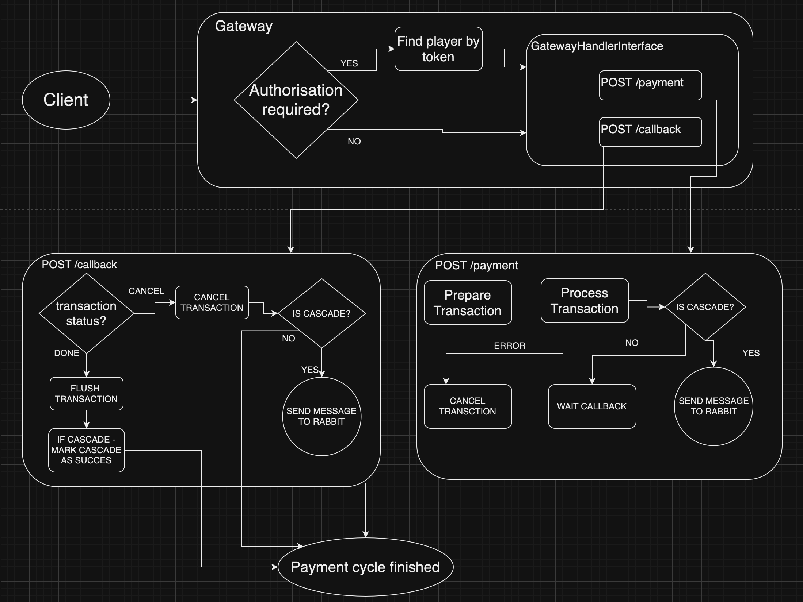

# Итоговая работа по курсу Архитектура и шаблоны проектирования

## Тема: Платежный Каскад

Данный проект подразумевает наличие возможности как прямой работы с платежными провайдерами, так и запустить их в каскаде.

Цель: создать стабилную систему проведения платежа, которая позволит запрашивать платеж у провайдеров до тех пор,
пока либо не получим успех, либо не кончатся доступные провайдеры.
Каждый доступный провайдер может быть использован лишь один раз, при этом мы не ограничены в их количестве
И цикл жизни транзакции по каскаду будет продолжаться до финального состояния 

### В схеме ниже представлено поведение, при котором игрок инициализирует выплату,
### а так же схему поведения при получении веб-хука от провайдера с решением по транзакции

При создании платежа платежные данные шифруются уникальным ключом и хранятся в БД
Завершение цикла жизни платежа подразумевает удаления ключа для дешифровки платежных данных
(данные остаются в зашифрованном виде)

### В схеме ниже представлено поведение каскада

### В данной работе не использовался JWT (тем не менее его не трудно добавить, по аналогии с домашним заданием №9)
\App\AuthService\AuthService

### Так же в данной работе не была реализована система логирования в виду нехватки времени,
### Тем не менее комментарием указаны поинты, где это логирование нужно
