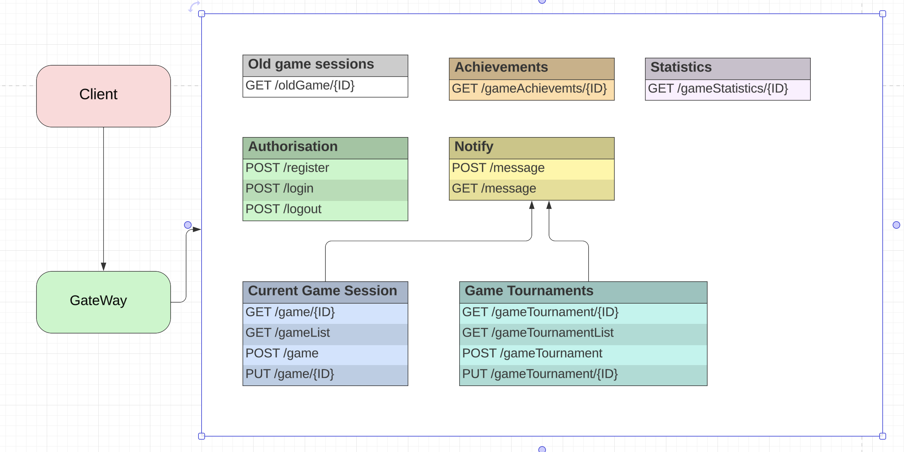

# Курс Архитектура и шаблоны проектирования

## Пометки для задание 8: RabbitMQ

### Формат сообщения:

scopeId - обозначает конкретный скоуп. В рамках проекта - это ID игры
objectId - обозначает ID космического объекта в рамках игры.
commandClass - строковое значение пути к классу команды. Обозначает действие, которое необходимо выполнить
parameterList - аргументы для команды (если необходимо). Для поддержания формата создан специальный объект RabbitMessageParameter

RabbitMessageParameter состоит из ключа-параметра, который обновляется у космического объекта и значений

## Задание 10: Разработать микросервисную архитектуру для игры ~~Танки~~ _Космическая битва_ (или любая другая)
1. Client - внешнее подключение: браузер / приложение / любой другой способ. По сути для нас это инициатор
2. Gateway - единая точка входа. Выполняет маршрутизацию на микросервисы, в зависимости от полученного запроса с Client.
3. Authorization - сервис отвечающий за аутентификацию путем выдачи токена. Возможные Endpoints: <ul><li>POST /login - Получение токена</li><li>POST /register - Регистрация, ответом приходит токен (объединяет в себе возможности /login)</li><li>POST /logout - Пометить токен истекшим, тем семым реализовав выход из системы</li></ul>
4. Current Game Session (относится к сессиям, которые не были завершены и перемещены на хранение) - сервис, который отвечает за информацию о текущих игровых сессиях. Возможные Endpoints: <ul> <li>GET /game/{ID} - Просмотр игровой сессии по ID</li> <li>GET /gameList - Просмотр списка игровых сессий</li> <li>POST /game - Создать новую игровую сессию</li> <li>PUT /game/{ID} - внесение изменений в указанную игровую сессию</li></ul>
5. Game Tournaments - сервис, который отвечает за организацию и проведение соревнований. Возможные Endpoints: <ul> <li>GET /gameTournament/{ID} - Просмотр заданного турнира</li> <li>GET /gameTournamentList - Просмотр списка турниров</li> <li>POST /gameTournament - Создание турнира</li> <li>PUT /gameTournament/{ID} - Редактирование турнира</li></ul>
6. Statistics - сервис, который отвечает за статистику боев. Возможные Endpoints: <ul> <li>GET /fightsStatistics/{ID} - Просмотр статистики по игровой сессии</li></ul>
7. Achievements - сервис, который отвечает за информацию о достижении в игровых сессиях. Возможные Endpoints: <ul> <li>GET /gameAchievements/{ID} - Просмотр достижений по заданной игровой сессии/li></ul>
8. Notify - сервис, который отвечает за уведомления. Возможные Endpoints: <ul> <li>GET /message - Просмотр уведомлений/li><li>POST /message - Создание уведомления/li></ul>
9. Old Game Sessions (Игровые сессии, которые были переданы в архив) - сервис, который отвечает за информацию о завершенных/остановленных игровых сессиях. Возможные Endpoints: <ul> <li>GET /oldGame/{ID} - Просмотр информации по завершенной игровой сессии/li></ul>

### Узкие места
1. Gateway - одна точка входа. Решается увеличением потоков (экземплчров сервиса) во избежание получения "бутылочного горлышка" и повышения отказоустойчивости
2. Authorization - увеличить количество экземпляров, применить кэширование, использовать оптимальный срок жизни токена (час основной токен, сутки - refresh токен).
3. Current Game Session - Должен выдерживать большие нагрузки. + Соблюдение Solid позволит менять версионность незаметно для игроков.
4. Old Game Sessions - нужно постоянно поддавать сервис анализу для выбора пути агрегаций и развития БД - залог успеха запросы не превышающие 20мс. 

### Часто меняющиеся компоненты:
1. Чаще всего будут меняться 2 микросервиса это Current Game Session и Game Tournaments. Требуется особо внимательный подход к проектированию сервисов с соблюдением SOLID, чтобы обязательно соблюдался принцип открытости-замкнутости. Оба сервиса должны обновляться "незаметно" для игроков и создавать ощущение мнгновенного отклика 

### Схема

